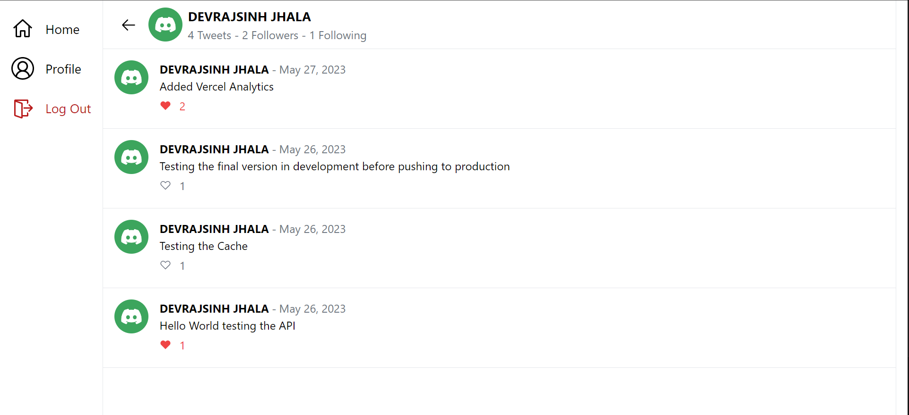

# Chatify Social Media App

It is a full stack social media app where you can voice your opinions, like others opinion, follow other people and view their profiles as well.

## Screenshots




## Tech Stack

**Client:** Next.js 12, TypeScript, TailwindCSS, NextAuth.js

**Server:** tRPC, Prisma, PlanetScale

## Installation

Clone this repository and cd to <project_location>

```bash
  npm install
  npm run dev
```

## Environment Variables

To run this project, you will need to add the following environment variables to your .env file

`DATABASE_URL`

`NEXTAUTH_SECRET`

`NEXTAUTH_URL`

`DISCORD_CLIENT_ID`

`DISCORD_CLIENT_SECRET`

`GOOGLE_CLIENT_SECRET`

`GOOGLE_CLIENT_ID`

## Features

- Light/dark mode toggle
- Login using Discord/Google
- Post your opinions
- Like your or others opinions
- View your or others profile
- Follow/Unfollow other people

## License

[MIT](https://choosealicense.com/licenses/mit/)

## Authors

- [@Devrajsinh Jhala](https://www.github.com/Devrajsinh-Jhala)
